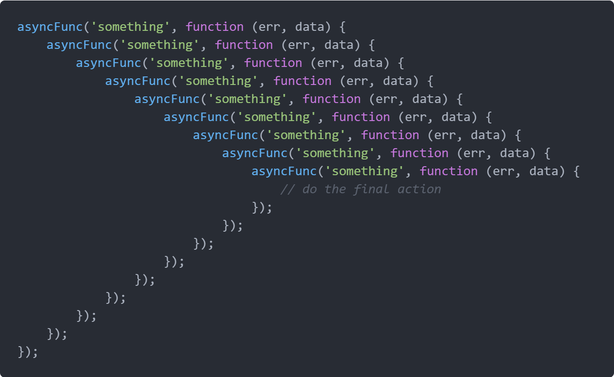

# project-loom

Project loom is all about making concurrency easier (for developers) on the JVM. It is included in Java 16 and is still in experimental phase. Download the early access builds [here](https://jdk.java.net/loom/)

## Concurrency

We can think of concurrency as interleaving of independent tasks. 


In an HTTP server you can think of Request handling as an independent task. Requests are independent of each other but share the resources that are required to execute the task (CPU, IO etc). 
### Differences in the Unit of Concurrency
 - For a HTTP server the unit of concurrency is the request itself.
 - For the underlying OS the unit of concurrency is the OS thread.
 - Unit of concurrency in the JVM is `java.lang.Thread`. We will refer to this as JVM Thread

An HTTP server (written with blocking IO), will allocate a JVM Thread to each incoming request from a pool of JVM Threads. The JVM Thread will execute your code sequentially. An example:

```
validate(request) // JVM thread is in action
fetchDataFromDB(request) // JVM thread is blocked
makeExternalAPICall() // JVM thread is blocked
giveResponse() // JVM thread is in action
```
If you look at the the functions `fetchDataFromDB()` and `makeExternalAPICall()` you will notice that the thread is not doing any work there. It is just waiting. This IO is referred to as `Blocking IO`.

Looking back at the differences in unit of concurrency: if we need to increase the throughput, i.e, the number of requests being handled at given point of time, then we need to increase the number of JVM Threads. Sounds reasonable. A million requests handled by a million JVM Threads.

### The Problem

The problem with scaling JVM Threads is that JVM Threads are just thin wrappers around OS threads. JVM Thread and OS Thread have a 1:1 mapping. So creating a JVM Thread creates an OS Thread. A few things to know about OS Threads:
- OS Threads are precious resources. Blocking a thread is is huge waste of this resource.
- Creating hundreds of thousands of OS threads is not possible.
- Switching between threads is expensive.

### In comes Asynchronous NIO in JDK
To combat the above problems asynchronous apis were introduced in the `java.nio` package. These go to great lengths to not block threads. The  thread is returned to the thread pool (with a callback registered) for the duration of the blocking call (external API or database call). There is an interrupt triggered when response is made available from the external call and the callback is invoked on another thread from the thread pool.

### Advantages of Async IO
 - More efficient as we just made sure that we don't block any JVM threads (and in turn OS threads). They are all doing some work
 - We can now handle more requests as opposed to from when we were blocking threads

 ### The Problem
  - Async code is hard to reason about as a developer. Composing functions is not possible with callbacks. A lot of callbacks can lead to "Callback Hell"
  - Loss of context. The thread carrying out the task prior to the IO call and the thread carrying out the task after the IO call are not guaranteed to be the same. A random thread from the thread pool is picked up and assigned to execute the callback code. As the unit of concurrency on the JVM is a JVM Thread, thread locals, exception stack traces are all bound to the thread.



### In comes Futures
To combat the problem of composibility, `CompletableFuture` was introduced into the JDK. A `CompletableFuture<T>` will result in value of type `T` or an error. You could now have lots of futures doing many computations without worrying about hogging the underlying thread pool because of it's async nature.

### The problem
- Though futures solving the problem of composibility, they are still a library construct. That means they will go `viral` in your code base. All your functions right from the handler to the database layer need to return futures.
- They still don't solve the problem of `Loss of context` mentioned above. The exception stacktraces are not useful because the composed futures would all be computed on different threads.

```
import scala.concurrent.Future
import scala.util.{Success, Failure}

case class UserDetails(name: String, phone: String, age: Int)

case class UPIResponse(bankName: String, bankID: String, lastTransactionOn: java.time.Instant)

def fetchUserDetails(userId: UserID): Future[UserDetails] = ???

def fetchUPIDetails(phone: String): Future[UPIResponse] = ???

def isBankPaymentWorking(bankID: String): Future[Boolean] = ???

val userID: UserID = ???

/*
The 3 API calls are sequential but they are not guaranteed to run on the same underlying OS thread.
*/
fetchUserDetails(userID)
  .flatMap(userDetails => fetchUPIDetails(userDetails.phone))
  .flatMap(upiResponse => isBankPaymentWorking(upiResponse.bankID))
  .onComplete {
    case Success(isWorking) => println("The bank's payment is working")
    case Failure(exception) => println(exception.getStackTrace)
  }
```

### In comes Project Loom

Project loom brings in green threads to the JVM. These green threads are called virtual threads. They DO NOT map 1:1 to the OS Threads. So, a programmer is free to create as many virtual threads as they want. We will refer to these threads as Virtual Threads.

### The new unit of concurrency on the JVM
Virtual Threads now become the new unit of concurrency in JVM. The developer need not worry about the underlying OS threads. A few things about Virtual Threads:
- Creating and blocking virtual threads is cheap
- This is because they do not map 1:1 to OS Threads
- JVM can support millions of virtual threads, allowing you to map the unit of concurrency of the application domain to the unit of concurrency in the runtime.

